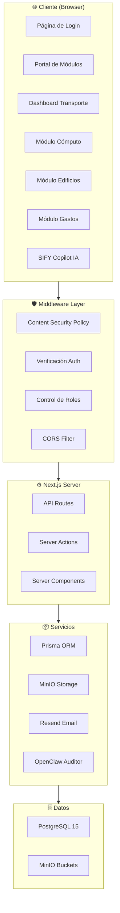
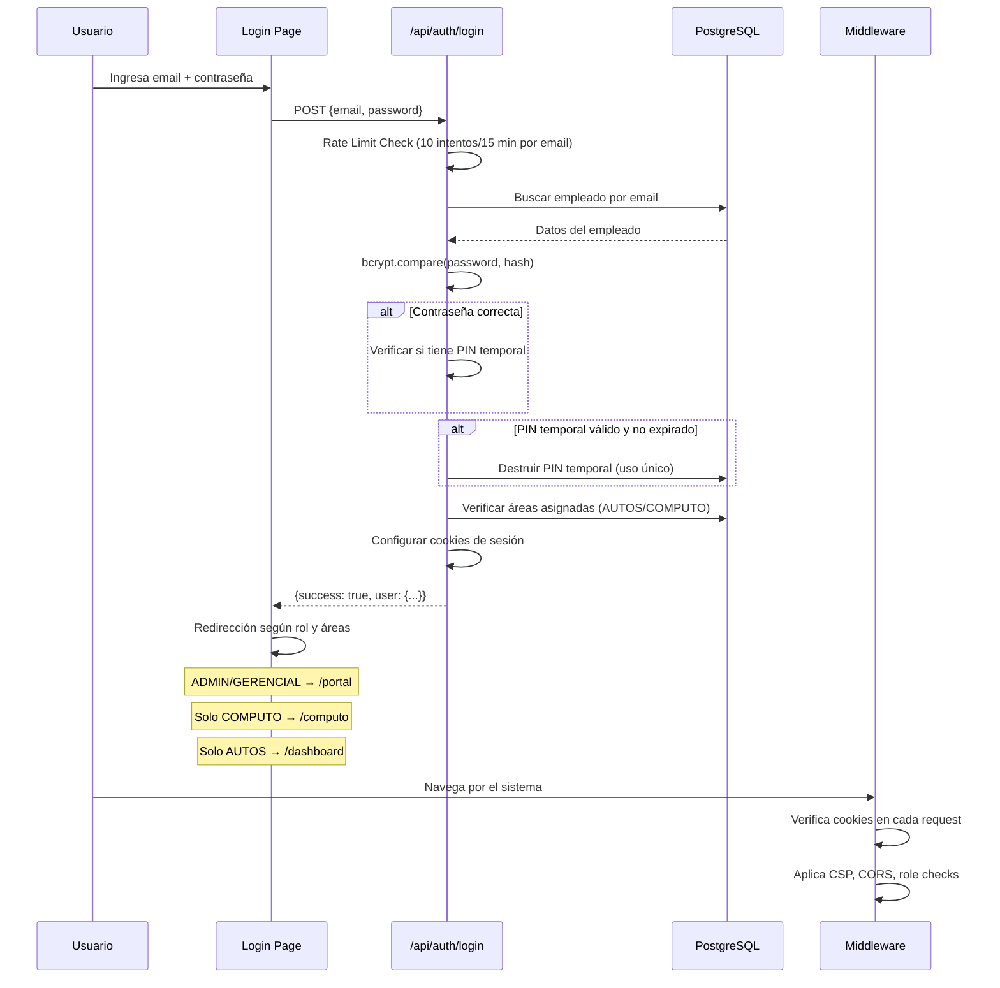
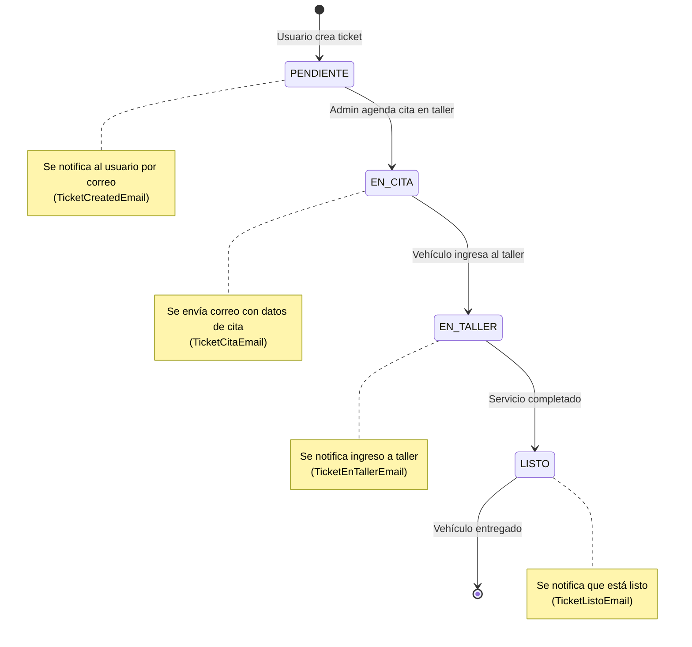

# 📘 Documentación Técnica — SIFYGSA Fleet (Infraestructura BPMS)

> **Versión del documento:** 1.0  
> **Fecha:** 6 de julio de 2026  
> **Sistema:** Infraestructura BPMS — SIFYGSA S.A. de C.V.  
> **Nombre del proyecto:** `sifygsa-fleet`

---

## 1. Visión General del Sistema

**SIFYGSA Fleet** (internamente llamado **Infraestructura BPMS**) es una plataforma web integral diseñada para la gestión operativa de infraestructura corporativa de la empresa SIFYGSA S.A. de C.V. El sistema permite administrar múltiples áreas de activos físicos y digitales a través de módulos independientes pero interconectados.

### 1.1 ¿Qué problema resuelve?

- Centralizar la gestión de la **flotilla vehicular** (mantenimientos, costos, verificaciones, documentos, checklists).
- Administrar el **inventario de equipos de cómputo** (laptops, PCs, periféricos) con planes de mantenimiento preventivo.
- Controlar **gastos generales** (caja chica, viáticos, comprobaciones, programación semanal de pagos).
- Gestionar **inspecciones de edificios** corporativos.
- Mantener un **programa anual** de actividades de infraestructura.
- Proveer **auditoría inteligente** de todas las acciones del sistema mediante IA.
- Ofrecer un **asistente conversacional de IA** (SIFY Copilot) para consultas rápidas sobre la flota.

### 1.2 Módulos del sistema

| Módulo | Estado | Ruta | Descripción |
|---|---|---|---|
| 🚗 Transporte | ✅ Activo | `/dashboard` | Flota vehicular completa |
| 💻 Cómputo | ✅ Activo | `/computo` | Inventario y mantenimiento TI |
| 🏢 Edificios | ✅ Activo | `/edificios` | Inspecciones de inmuebles |
| 💰 Gastos Generales | ✅ Activo | `/gastos` | Caja chica, viáticos, programación |
| 📅 Programa Anual | ✅ Activo | `/programa-anual` | Calendario de actividades |
| ✅ Verificaciones | ✅ Activo | `/verificaciones` | Verificación vehicular semestral |
| 📋 Auditoría | ✅ Activo | `/auditoria` | Bitácora inteligente del sistema |
| 📞 Telefonía | 🔜 Próximamente | — | — |
| 📹 Video y Vigilancia | 🔜 Próximamente | — | — |
| ❄️ Aires Acondicionados | 🔜 Próximamente | — | — |
| 🪑 Mobiliario | 🔜 Próximamente | — | — |

---

## 2. Stack Tecnológico

### 2.1 Tecnologías principales

```
┌──────────────────────────────────────────────────────────┐
│  FRONTEND                                                │
│  • Next.js 16.1.6 (App Router)                           │
│  • React 19.2.3                                          │
│  • TypeScript 5.x                                        │
│  • TailwindCSS 4.x                                       │
│  • Lucide React (iconografía)                            │
│  • Recharts (gráficas)                                   │
│                                                          │
│  BACKEND (Server-Side)                                   │
│  • Next.js API Routes (Route Handlers)                   │
│  • Next.js Server Actions                                │
│  • Prisma ORM 6.19.2                                     │
│                                                          │
│  BASE DE DATOS                                           │
│  • PostgreSQL 15 (Easypanel)                             │
│                                                          │
│  ALMACENAMIENTO DE ARCHIVOS                              │
│  • MinIO (S3-compatible, Easypanel)                      │
│                                                          │
│  SERVICIOS EXTERNOS                                      │
│  • Resend (envío de correos transaccionales)             │
│  • Groq API (LLM para IA — futuro)                      │
│                                                          │
│  AUTENTICACIÓN                                           │
│  • Cookies HTTP (sesión basada en cookies)               │
│  • bcryptjs (hash de contraseñas)                        │
│                                                          │
│  GENERACIÓN DE DOCUMENTOS                                │
│  • jsPDF + jspdf-autotable (PDFs)                        │
│  • ExcelJS (hojas de cálculo)                            │
│  • html2canvas (capturas para PDF)                       │
│                                                          │
│  INFRAESTRUCTURA                                         │
│  • Docker + Docker Compose                               │
│  • Easypanel (hosting)                                   │
│  • Node.js 20 (Nixpacks)                                 │
└──────────────────────────────────────────────────────────┘
```

### 2.2 Dependencias clave

| Paquete | Versión | Propósito |
|---|---|---|
| `next` | 16.1.6 | Framework fullstack React |
| `react` / `react-dom` | 19.2.3 | Librería UI |
| `@prisma/client` | ^6.19.2 | ORM para PostgreSQL |
| `bcryptjs` | ^3.0.3 | Hashing de contraseñas |
| `minio` | ^8.0.7 | Cliente S3 para almacenamiento de archivos |
| `resend` | ^4.1.2 | API de envío de correos |
| `recharts` | ^3.8.1 | Gráficas y visualización de datos |
| `lucide-react` | ^0.574.0 | Iconografía SVG |
| `jspdf` | ^4.2.1 | Generación de PDFs en cliente |
| `exceljs` | ^4.4.0 | Generación de archivos Excel |
| `date-fns` | ^4.4.0 | Utilidades de manejo de fechas |
| `file-saver` | ^2.0.5 | Descargas de archivos en el navegador |

---

## 3. Estructura del Proyecto

```
SIFYGSA_PROJET/
├── app/                          # 📂 App Router de Next.js
│   ├── page.tsx                  # 🔐 Página de Login (raíz)
│   ├── layout.tsx                # 🏗️ Layout raíz (fuentes, CSP nonce)
│   ├── globals.css               # 🎨 Estilos globales + variables CSS
│   │
│   ├── actions/                  # ⚡ Server Actions
│   │   └── verificaciones.ts     # Lógica de verificación vehicular
│   │
│   ├── api/                      # 🌐 API Routes (Route Handlers)
│   │   ├── auth/                 # Autenticación (login, logout, reset, check-role)
│   │   ├── vehiculos/            # CRUD de vehículos
│   │   ├── tickets/              # Solicitudes de servicio
│   │   ├── empleados/            # Gestión de empleados
│   │   ├── costos/               # Costos de mantenimiento
│   │   ├── computo/              # Inventario TI (inventario, documentos, tickets)
│   │   ├── gastos/               # Caja chica, viáticos, comprobaciones, programación
│   │   ├── edificios/            # Edificios e inspecciones
│   │   ├── checklists/           # Checklists PDF de vehículos
│   │   ├── documentos/           # Documentos de unidades
│   │   ├── evidencia/            # Subida de archivos evidencia
│   │   ├── mantenimientos/       # Reportes y planes de mantenimiento TI
│   │   ├── programa-anual/       # Programa anual de actividades
│   │   ├── seguridad/            # Gestión de contraseñas y accesos
│   │   ├── cron/                 # Tareas programadas (notificaciones documentos)
│   │   ├── ai/                   # Endpoint del chatbot IA
│   │   ├── webhooks/             # Webhooks externos
│   │   ├── logout/               # Cierre de sesión (borrado de cookies)
│   │   ├── mis-checklists/       # Checklists del usuario autenticado
│   │   └── mis-documentos/       # Documentos del usuario autenticado
│   │
│   ├── portal/                   # 🏠 Hub central de módulos
│   ├── dashboard/                # 🚗 Módulo de Transporte (flota vehicular)
│   │   ├── DashboardMenu.tsx     # Menú de pestañas + KPIs
│   │   ├── inventario/           # Inventario de autos
│   │   ├── servicios/            # Central de servicios (tickets)
│   │   ├── seguimiento/          # Seguimiento de tickets
│   │   ├── costos/               # Control de costos
│   │   ├── empleados/            # Directorio de personal
│   │   ├── usuarios/             # Gestión de usuarios
│   │   ├── perfil/               # Perfil del usuario
│   │   ├── checklists/           # Checklists (admin)
│   │   ├── mis-checklists/       # Checklists (usuario)
│   │   ├── documentos/           # Documentos de unidad (admin)
│   │   ├── mis-documentos/       # Documentos de unidad (usuario)
│   │   ├── historial/            # Historial de cambios
│   │   ├── seguridad/            # Panel de seguridad
│   │   └── tickets/              # Detalle de tickets
│   │
│   ├── computo/                  # 💻 Módulo de Cómputo
│   │   ├── inventario/           # Inventario de equipos
│   │   ├── documentos/           # Documentos de equipos
│   │   ├── servicios/            # Servicios/tickets TI
│   │   ├── empleados/            # Empleados asignados
│   │   └── mantenimientos/       # Planes y reportes de mantenimiento
│   │
│   ├── edificios/                # 🏢 Módulo de Edificios
│   ├── gastos/                   # 💰 Módulo de Gastos
│   │   ├── caja-chica/           # Caja chica semanal
│   │   ├── viaticos/             # Viáticos
│   │   ├── comprobaciones/       # Comprobaciones de gastos
│   │   └── programacion/         # Programación semanal de pagos
│   │
│   ├── verificaciones/           # ✅ Verificación vehicular
│   ├── programa-anual/           # 📅 Programa anual
│   └── auditoria/                # 📋 Bitácora de auditoría
│
├── components/                   # 🧩 Componentes reutilizables
│   ├── ui/                       # Componentes de UI general
│   │   ├── Navbar.tsx            # Barra de navegación global (53KB — muy completa)
│   │   ├── PremiumSelect.tsx     # Select personalizado premium
│   │   ├── ScrollToTop.tsx       # Botón scroll-to-top
│   │   └── SystemModal.tsx       # Modal del sistema
│   │
│   ├── ai/                       # Componentes de IA
│   │   └── CopilotChat.tsx       # Chat flotante con IA (SIFY Copilot)
│   │
│   ├── security/                 # Componentes de seguridad
│   │   ├── IdleTimer.tsx         # Cierre de sesión por inactividad (15 min)
│   │   └── RoleGuard.tsx         # Vigilante de roles en tiempo real
│   │
│   └── emails/                   # Plantillas de correo electrónico (React Email)
│       ├── WelcomeEmail.tsx
│       ├── ResetPasswordEmail.tsx
│       ├── SecurityAlertEmail.tsx
│       ├── TicketCreatedEmail.tsx
│       ├── TicketUpdateEmail.tsx
│       ├── TicketCitaEmail.tsx
│       ├── TicketEnTallerEmail.tsx
│       ├── TicketListoEmail.tsx
│       ├── TicketComputoEmail.tsx
│       ├── TicketComputoAdminEmail.tsx
│       ├── DocumentoExpiradoEmail.tsx
│       ├── MantenimientoAsignadoEmail.tsx
│       └── MantenimientoReprogramadoEmail.tsx
│
├── lib/                          # 📚 Utilidades y servicios
│   ├── db.ts                     # Singleton de Prisma Client
│   ├── email.ts                  # Servicio centralizado de correo (Resend)
│   ├── minio.ts                  # Cliente MinIO + funciones de upload
│   │
│   ├── ai/                       # Motor de IA
│   │   ├── ai-actions.ts         # 25+ funciones de consulta para el Copilot
│   │   ├── openclaw.ts           # Auditor inteligente (análisis de eventos)
│   │   └── excel-generator.ts    # Generador de reportes Excel para IA
│   │
│   ├── utils/                    # Utilidades
│   │   ├── audit.ts              # Función centralizada de auditoría
│   │   └── verificaciones.ts     # Cálculo de plazos de verificación vehicular
│   │
│   └── pdf/                      # Generación de documentos
│       ├── generarFRM.ts         # Generación de formato FRM (mantenimiento TI)
│       ├── exportarFRM_Excel.ts  # Exportar FRM a Excel
│       └── generarCartaComputo.ts # Generar carta responsiva de equipo
│
├── prisma/                       # 🗄️ Base de datos
│   ├── schema.prisma             # Esquema completo (27 modelos)
│   ├── seed.ts                   # Datos semilla para desarrollo
│   ├── migrations/               # Historial de migraciones
│   └── sql/                      # Scripts SQL auxiliares
│
├── public/                       # 📁 Archivos estáticos (logo, imágenes, noise.png)
├── middleware.ts                  # 🛡️ Middleware (CSP, Auth, CORS, roles)
├── next.config.ts                # ⚙️ Configuración de Next.js + headers de seguridad
├── Dockerfile                    # 🐳 Imagen Docker
├── docker-compose.yml            # 🐳 Orquestación local
├── .env                          # 🔑 Variables de entorno
└── package.json                  # 📦 Dependencias y scripts
```

---

## 4. Arquitectura del Sistema

### 4.1 Diagrama de alto nivel



### 4.2 Flujo de autenticación



### 4.3 Sistema de roles y permisos

El sistema implementa un esquema de acceso basado en **roles** y **áreas**:

#### Roles

| Rol | Nivel | Acceso |
|---|---|---|
| `ADMIN` | Administrador total | Todos los módulos, todas las funciones |
| `GERENCIAL` | Nivel gerencial | Equivalente a ADMIN en permisos de acceso |
| `USER` | Usuario estándar | Solo módulos asignados por área |

#### Áreas (para usuarios `USER`)

| Área | Módulo accesible |
|---|---|
| `AUTOS` | `/dashboard` (Transporte) |
| `COMPUTO` | `/computo` (Cómputo) |
| `GASTOS` | `/gastos` (Gastos Generales) |

> [!IMPORTANT]
> Las áreas se asignan **dinámicamente** al iniciar sesión. Si un usuario tiene un auto asignado en `Inventario_Automoviles`, obtiene el área `AUTOS`. Si tiene un equipo en `Inventario_Computo`, obtiene `COMPUTO`. Los admins reciben todas las áreas automáticamente.

#### Rutas protegidas (Middleware)

- **Solo autenticados:** `/portal`, `/dashboard`, `/computo`, `/programa-anual`, `/verificaciones`, `/auditoria`, `/gastos`
- **Solo ADMIN/GERENCIAL:** `/programa-anual`, `/verificaciones`, `/auditoria`, `/dashboard/inventario`, `/dashboard/costos`, `/dashboard/checklists`, `/dashboard/documentos`, `/dashboard/empleados`, `/dashboard/seguridad`

---

## 5. Base de Datos (Prisma Schema)

### 5.1 Proveedor y conexión

- **Motor:** PostgreSQL 15
- **ORM:** Prisma 6.19.2
- **Connection pooling:** Soportado vía `POSTGRES_PRISMA_URL`
- **Direct URL:** `POSTGRES_URL_NON_POOLING` (para migraciones)

### 5.2 Modelos y relaciones

El esquema contiene **27 modelos** organizados en dominios funcionales:

#### Dominio: Usuarios y Empleados

| Modelo | PK | Descripción |
|---|---|---|
| `Empleados` | `Email` (VARCHAR 50) | Tabla maestra de usuarios del sistema |
| `Telefono` | `[Email_Empleado, No_Telefonico]` | Teléfonos de contacto (composite PK) |
| `Historial_Empleados` | `Id_Historial_Emp` (autoincrement) | Registro de cambios en datos de empleados |

> [!NOTE]
> La tabla `Empleados` usa el **email como llave primaria**, no un ID numérico. Esto simplifica relaciones pero requiere cuidado al cambiar correos.

**Campos clave de `Empleados`:**
- `Password`: Hash bcrypt de la contraseña
- `Rol`: `ADMIN` | `GERENCIAL` | `USER`
- `Estatus_Acceso`: `Activo` | `Inactivo`
- `Admin_TI`: Flag booleano para permisos especiales de TI
- `Pin_Temporal` + `Expiracion_Pin`: Para recuperación de contraseña (un solo uso)

---

#### Dominio: Flota Vehicular (Transporte)

| Modelo | PK | Descripción |
|---|---|---|
| `Inventario_Automoviles` | `Consecutivo` (VARCHAR 10) | Inventario completo de vehículos |
| `Historial_Registro_Automovil` | `Id_Historial_Reg` (auto) | Historial de reasignaciones de vehículos |
| `Historial_Auto` | `Id_Historial` (auto) | Bitácora operativa del vehículo (km, estado) |
| `Solicitud` | `Pk_folio_ticket` (VARCHAR 25) | Tickets/solicitudes de servicio mecánico |
| `Procesos` | `Id_Proceso` (auto) | Pasos/actualizaciones dentro de un ticket |
| `Costos_Mantenimiento` | `Id_Costo` (auto) | Registro de costos por mantenimiento |
| `Checklist` | `id` (auto) | Checklists PDF subidos por unidad |
| `Documentos_Unidad` | `id` (auto) | Documentos oficiales (pólizas, tarjetas, etc.) |
| `Verificacion_Vehicular` | `Id_Verificacion` (auto) | Control de verificaciones vehiculares semestrales |

**Relaciones principales:**
```
Empleados (Email) ─────────── 1:N ──→ Solicitud (Email_Empleado)
Empleados (Email) ─────────── 1:N ──→ Inventario_Automoviles (Email_encargado)
Inventario_Automoviles ─────── 1:N ──→ Solicitud (Consecutivo)
Inventario_Automoviles ─────── 1:N ──→ Costos_Mantenimiento
Inventario_Automoviles ─────── 1:N ──→ Checklist
Inventario_Automoviles ─────── 1:N ──→ Documentos_Unidad
Inventario_Automoviles ─────── 1:N ──→ Verificacion_Vehicular
Solicitud ──────────────────── 1:N ──→ Procesos (seguimiento del ticket)
```

**Flujo de estados de un ticket (`Solicitud.Estado`):**
```
PENDIENTE → EN CITA → EN TALLER → LISTO
```

**Campos clave de `Inventario_Automoviles`:**
- `Consecutivo`: Identificador interno (ej. `SFG-001`)
- `Placa`: Placa vehicular (unique)
- `Estatus_Operativo`: `Activo en flota` | `En Reparación` | `Dado de baja` | `Siniestrado`
- `Estado_Unidad`: Boolean (activo/inactivo general)

---

#### Dominio: Cómputo (TI)

| Modelo | PK | Descripción |
|---|---|---|
| `Inventario_Computo` | `C_Interno` (VARCHAR 100) | Inventario de equipos de cómputo |
| `Historial_Registro_Computo` | `Id_Historial_Reg` (auto) | Historial de cambios en equipos |
| `Documentos_Computo` | `id` (auto) | Documentos adjuntos de equipos |
| `Solicitud_Computo` | `Pk_folio_ticket` (VARCHAR 100) | Tickets de soporte técnico TI |
| `Costos_Computo` | `Id_Costo` (auto) | Costos de mantenimiento de equipos |
| `Plan_Mantenimiento` | `Id_Plan` (auto) | Planes de mantenimiento preventivo |
| `Reporte_Mantenimiento` | `Id_Reporte` (auto) | Reportes de ejecución de mantenimiento |
| `Historial_Partes` | `Id_Parte` (auto) | Registro de cambio de partes/hardware |

**Campos destacados de `Reporte_Mantenimiento`:**
- Checklist de actividades: `Limpieza_Interna`, `Limpieza_Externa`, `Revision_Software`, `Actualizacion_SO`, `Revision_Hardware`, `Respaldo_Info`, `Revision_Antivirus`, `Revision_Red`
- Firmas digitales: `Firma_Tecnico`, `Firma_Responsable`
- Fotos: `Foto_Antes`, `Foto_Despues`, `Fotos_Extra`
- Formato serializado: `Datos_Formato` (JSON), `Consecutivo_FRM` (unique)
- Estado: `PENDIENTE` | (otros estados del flujo)

---

#### Dominio: Gastos y Finanzas

| Modelo | PK | Descripción |
|---|---|---|
| `Caja_Chica` | `Id_CajaChica` (auto) | Movimientos de caja chica (cargo/abono/saldo) |
| `Viaticos` | `Id_Viatico` (auto) | Registro de viáticos por empleado |
| `Comprobacion_Gastos` | `Id` (auto) | Comprobación de gastos con evidencia |
| `Programacion_Semanal` | `Id` (auto) | Programación semanal de pagos a proveedores |

**Nota:** Los módulos de gastos trabajan con un esquema **Año + Semana** para organizar los registros.

---

#### Dominio: Edificios

| Modelo | PK | Descripción |
|---|---|---|
| `Edificio` | `Id_Edificio` (auto) | Catálogo de edificios/sucursales |
| `Inspeccion_Edificio` | `Id_Inspeccion` (auto) | Inspecciones realizadas a edificios |
| `Inspeccion_Area` | `Id_Area` (auto) | Áreas inspeccionadas (con conteo de puertas/luminarias) |
| `Inspeccion_Detalle` | `Id_Detalle` (auto) | Items individuales de inspección por área |
| `Foto_Inspeccion_Edificio` | `Id_Foto` (auto) | Fotos adjuntas a inspecciones |

---

#### Dominio: Programa Anual

| Modelo | PK | Descripción |
|---|---|---|
| `Programa_Anual` | `Id_Programa` (auto) | Categorías del programa anual (unique por `[Anio, Categoria]`) |
| `Programa_Mes` | `Id` (auto) | Meses programados/realizados (unique por `[Id_Programa, Mes]`) |

---

#### Dominio: Auditoría

| Modelo | PK | Descripción |
|---|---|---|
| `Bitacora_Auditoria` | `Id_Auditoria` (auto) | Log de todas las acciones del sistema |

---

## 6. Sistema de Autenticación y Seguridad

### 6.1 Flujo de login

Archivo: [route.ts](file:///c:/Users/AVH-COM-330/Documents/SIFYGSA_PROJET/app/api/auth/login/route.ts)

1. **Rate limiting por correo:** Máximo 10 intentos fallidos por email. Al llegar al límite, se bloquea ese correo específico por **15 minutos**. Se usa un `Map` en memoria del servidor.

2. **Doble cerradura (password + PIN):**
   - Primero se intenta autenticar con la contraseña normal (hash bcrypt).
   - Si falla, se verifica si existe un PIN temporal vigente (para recuperación de contraseña).
   - Los PINs son de **un solo uso**: se destruyen tras autenticarse exitosamente con ellos.

3. **Asignación dinámica de áreas:**
   - Se consulta `Inventario_Automoviles` e `Inventario_Computo` para determinar qué áreas tiene asignadas el usuario.
   - Los admins reciben `['AUTOS', 'COMPUTO']` automáticamente.

4. **Cookies de sesión:**
   - `user_email`: Identificador de sesión
   - `user_role`: Rol del usuario
   - `user_name`: Nombre para display
   - `user_areas`: JSON con áreas asignadas
   - `user_admin_ti`: Flag de admin de TI

### 6.2 Middleware de seguridad

Archivo: [middleware.ts](file:///c:/Users/AVH-COM-330/Documents/SIFYGSA_PROJET/middleware.ts)

El middleware se ejecuta en **cada request** (excepto estáticos) y maneja:

- **Content Security Policy (CSP):** Genera un nonce único por request para scripts, restringe orígenes de imágenes, frames y conexiones.
- **Protección de rutas:** Verifica cookies de sesión y redirige a `/` si no está autenticado.
- **Control de roles:** Bloquea acceso a rutas admin-only para usuarios `USER`.
- **Control de áreas:** Verifica que el usuario tenga el área correcta para acceder a `/dashboard` (AUTOS) o `/computo` (COMPUTO).
- **CORS para API:** Solo permite orígenes autorizados (`cloud.sifygsa.com`, `localhost:3000/3001`).

### 6.3 Headers de seguridad

Archivo: [next.config.ts](file:///c:/Users/AVH-COM-330/Documents/SIFYGSA_PROJET/next.config.ts)

| Header | Valor | Propósito |
|---|---|---|
| `X-Frame-Options` | `DENY` | Prevenir clickjacking |
| `X-Content-Type-Options` | `nosniff` | Prevenir MIME sniffing |
| `Referrer-Policy` | `strict-origin-when-cross-origin` | Control de referrer |
| `Permissions-Policy` | Restringe cámara, micrófono, geo | Minimizar superficie de ataque |
| `Strict-Transport-Security` | 2 años + preload | Forzar HTTPS |
| `Cross-Origin-Opener-Policy` | `same-origin` | Aislamiento de origen |
| `Cross-Origin-Resource-Policy` | `same-site` | Restricción de recursos |

### 6.4 Componentes de seguridad del cliente

#### IdleTimer

Archivo: [IdleTimer.tsx](file:///c:/Users/AVH-COM-330/Documents/SIFYGSA_PROJET/components/security/IdleTimer.tsx)

- Cierra la sesión automáticamente tras **15 minutos de inactividad**.
- Escucha eventos: `mousedown`, `mousemove`, `keydown`, `scroll`, `touchstart`, `click`.
- Componente invisible (renderiza `null`).

#### RoleGuard

Archivo: [RoleGuard.tsx](file:///c:/Users/AVH-COM-330/Documents/SIFYGSA_PROJET/components/security/RoleGuard.tsx)

- Verifica el rol del usuario **cada 5 segundos** consultando `/api/auth/check-role`.
- Si el rol cambió, la cuenta fue desactivada o eliminada: **destruye la sesión inmediatamente** y muestra un overlay informativo antes de redirigir al login.
- Tipos de expulsión con UI diferenciada:
  - `role_changed` (ámbar): Rol modificado por admin
  - `account_disabled` (rojo): Cuenta desactivada
  - `user_deleted` (rojo): Cuenta eliminada
  - `no_session` (azul): Sesión expirada

---

## 7. API Routes — Endpoints

### 7.1 Autenticación (`/api/auth/`)

| Método | Ruta | Descripción |
|---|---|---|
| `POST` | `/api/auth/login` | Iniciar sesión (email + password/PIN) |
| `POST` | `/api/auth/logout` | Cerrar sesión (borrar cookies) |
| `POST` | `/api/auth/reset-password` | Solicitar PIN temporal por correo |
| `GET` | `/api/auth/check-role` | Verificar vigencia de rol (usado por RoleGuard) |

### 7.2 Vehículos (`/api/vehiculos/`)

| Método | Ruta | Descripción |
|---|---|---|
| `GET/POST/PUT/DELETE` | `/api/vehiculos` | CRUD completo de vehículos |

### 7.3 Tickets de servicio (`/api/tickets/`)

| Método | Ruta | Descripción |
|---|---|---|
| `GET/POST` | `/api/tickets` | Listar y crear tickets |
| `PUT` | `/api/tickets/estado` | Actualizar estado de un ticket |

### 7.4 Empleados (`/api/empleados/`)

| Método | Ruta | Descripción |
|---|---|---|
| `GET/POST/PUT/DELETE` | `/api/empleados` | CRUD de empleados |

### 7.5 Costos (`/api/costos/`)

| Método | Ruta | Descripción |
|---|---|---|
| `GET/POST` | `/api/costos` | Gestión de costos de mantenimiento vehicular |
| `PUT/DELETE` | `/api/costos/[id]` | Actualizar/eliminar costo específico |
| `POST` | `/api/costos/upload` | Subir factura/comprobante |

### 7.6 Cómputo (`/api/computo/`)

| Método | Ruta | Descripción |
|---|---|---|
| `GET/POST/PUT/DELETE` | `/api/computo/inventario` | CRUD de equipos de cómputo |
| `GET/POST` | `/api/computo/documentos` | Documentos de equipos |
| `GET/POST/PUT` | `/api/computo/tickets` | Tickets de soporte TI |

### 7.7 Gastos (`/api/gastos/`)

| Método | Ruta | Descripción |
|---|---|---|
| `GET/POST/PUT/DELETE` | `/api/gastos/caja-chica` | Movimientos de caja chica |
| `GET/POST/PUT/DELETE` | `/api/gastos/viaticos` | Registro de viáticos |
| `GET/POST/PUT/DELETE` | `/api/gastos/comprobaciones` | Comprobaciones de gastos |
| `GET/POST/PUT/DELETE` | `/api/gastos/programacion` | Programación semanal de pagos |

### 7.8 Edificios (`/api/edificios/`)

| Método | Ruta | Descripción |
|---|---|---|
| `GET/POST` | `/api/edificios` | CRUD de edificios |
| `GET/POST/PUT` | `/api/edificios/inspecciones` | Inspecciones de edificios |

### 7.9 Otros endpoints

| Método | Ruta | Descripción |
|---|---|---|
| `GET/POST` | `/api/checklists` | Checklists de vehículos |
| `GET/POST` | `/api/documentos` | Documentos de unidades |
| `POST` | `/api/evidencia` | Subida de archivos de evidencia |
| `GET/POST` | `/api/mantenimientos` | Planes y reportes de mantenimiento TI |
| `GET/POST/PUT` | `/api/programa-anual` | Programa anual de actividades |
| `PUT` | `/api/seguridad` | Cambio de contraseñas |
| `GET` | `/api/cron` | Verificación de documentos por expirar |
| `POST` | `/api/ai/chat` | Endpoint del chatbot IA |
| `POST` | `/api/logout` | Borrado de cookies |
| `GET` | `/api/mis-checklists` | Checklists del usuario logueado |
| `GET` | `/api/mis-documentos` | Documentos del usuario logueado |

---

## 8. Servicios de Infraestructura

### 8.1 Base de datos — Prisma Client

Archivo: [db.ts](file:///c:/Users/AVH-COM-330/Documents/SIFYGSA_PROJET/lib/db.ts)

```typescript
// Patrón singleton para evitar múltiples conexiones en desarrollo (hot reload)
const globalForPrisma = global as unknown as { prisma: PrismaClient };
export const prisma = globalForPrisma.prisma || new PrismaClient();
if (process.env.NODE_ENV !== 'production') globalForPrisma.prisma = prisma;
```

### 8.2 Almacenamiento de archivos — MinIO

Archivo: [minio.ts](file:///c:/Users/AVH-COM-330/Documents/SIFYGSA_PROJET/lib/minio.ts)

- **Protocolo:** S3-compatible, alojado en Easypanel con SSL (puerto 443).
- **Buckets:**
  - `evidencias`: Fotos de evidencia de tickets
  - `checklists`: PDFs de checklists vehiculares
  - `documentos`: Documentos generales (pólizas, facturas, formatos)
- **Política de acceso:** Lectura pública (`s3:GetObject`) para servir archivos por URL directa.
- **Función `uploadToMinio`:** Recibe nombre del objeto, buffer y content-type, sube al bucket `documentos` y retorna la URL pública.

### 8.3 Correo electrónico — Resend

Archivo: [email.ts](file:///c:/Users/AVH-COM-330/Documents/SIFYGSA_PROJET/lib/email.ts)

- **Proveedor:** Resend API
- **Dominio verificado:** `cloud.sifygsa.com`
- **Remitente:** `SIFYGSA - Notificacion <notificaciones@cloud.sifygsa.com>`
- **Función centralizada:** `enviarCorreo({ to, subject, react })` — acepta componentes de React Email.

#### Plantillas de correo disponibles (13 templates)

| Template | Evento |
|---|---|
| `WelcomeEmail` | Bienvenida a nuevo usuario |
| `ResetPasswordEmail` | Envío de PIN temporal |
| `SecurityAlertEmail` | Alerta de seguridad |
| `TicketCreatedEmail` | Ticket creado (notifica al usuario) |
| `TicketUpdateEmail` | Actualización de ticket |
| `TicketCitaEmail` | Cita programada en taller |
| `TicketEnTallerEmail` | Vehículo ingresado a taller |
| `TicketListoEmail` | Vehículo listo para recoger |
| `TicketComputoEmail` | Ticket TI (notifica al usuario) |
| `TicketComputoAdminEmail` | Ticket TI (notifica al admin) |
| `DocumentoExpiradoEmail` | Documento próximo a expirar |
| `MantenimientoAsignadoEmail` | Mantenimiento TI asignado |
| `MantenimientoReprogramadoEmail` | Mantenimiento TI reprogramado |

---

## 9. Inteligencia Artificial

### 9.1 SIFY Copilot (Chat)

Archivo: [CopilotChat.tsx](file:///c:/Users/AVH-COM-330/Documents/SIFYGSA_PROJET/components/ai/CopilotChat.tsx)

- **Componente:** Botón flotante en la esquina inferior derecha que abre una ventana de chat.
- **Backend:** `/api/ai/chat` — procesa mensajes con contexto del sistema.
- **Capacidades:**
  - Consultar inventario de flota (totales, por empresa, por estatus)
  - Ver detalles de unidades específicas (por placa o consecutivo)
  - Listar tickets recientes y pendientes
  - Consultar directorio de empleados
  - Ver costos de mantenimiento
  - Predecir próximos servicios por kilometraje
  - Auditar cumplimiento de checklists
  - Generar reportes Excel descargables
  - Consultar inventario de cómputo
  - Consultar caja chica

- **Personalización por rol:**
  - Admin: Saludo genérico con acceso completo
  - Usuario: Saludo personalizado enfocado en su unidad asignada

### 9.2 OpenClaw — Auditor Inteligente

Archivo: [openclaw.ts](file:///c:/Users/AVH-COM-330/Documents/SIFYGSA_PROJET/lib/ai/openclaw.ts)

- **Propósito:** Intercepta todos los eventos de auditoría del sistema y los enriquece con análisis inteligente antes de guardarlos en `Bitacora_Auditoria`.
- **Flujo:** `logAuditoria()` → `openClawAuditor()` → `analizarConLLM()` → `prisma.bitacora_Auditoria.create()`
- **Categorías de análisis:**
  - Detección de diffs (cambios en campos específicos con formato `from` → `to`)
  - Alertas de login nocturno
  - Modificaciones en gastos (caja chica)
  - Altas de vehículos y equipos
  - Cambios de privilegios de Admin TI (marcado como crítico)
  - Eliminaciones (marcadas como críticas)

### 9.3 AI Actions — Funciones de consulta

Archivo: [ai-actions.ts](file:///c:/Users/AVH-COM-330/Documents/SIFYGSA_PROJET/lib/ai/ai-actions.ts)

25+ funciones que el Copilot puede invocar:

| Función | Descripción |
|---|---|
| `get_inventory_summary` | Resumen de inventario (total, activos, inactivos) |
| `get_fleet_status_summary` | Distribución por estatus operativo |
| `get_fleet_report` | Reporte detallado con datos del encargado |
| `get_unit_details` | Detalle completo de una unidad (por placa o consecutivo) |
| `get_fleet_stats` | Estadísticas por ubicación y departamento |
| `get_unassigned_units` | Vehículos sin encargado asignado |
| `get_dynamic_units` | Búsqueda avanzada con filtros dinámicos |
| `get_recent_tickets` | Últimos 10 tickets creados |
| `get_employee_directory` | Directorio filtrable de empleados |
| `get_employee_stats` | Estadísticas de personal |
| `get_checklists` | Checklists por vehículo |
| `get_unit_tickets` | Historial de tickets de una unidad |
| `get_unit_history` | Bitácora histórica de una unidad |
| `get_unit_assignment_history` | Historial de reasignaciones |
| `get_ticket_details` | Detalle completo de un ticket por folio |
| `get_pending_services` | Servicios pendientes/programados |
| `get_services_summary` | Conteo por estado de tickets |
| `get_fleet_alerts` | Alertas (sin seguro, pendientes altos) |
| `get_fleet_costs` | Costos totales + top 5 vehículos más costosos |
| `predict_upcoming_services` | Predicción de servicios por km (cada 10K km) |
| `get_my_unit` | Unidad asignada al usuario logueado |
| `audit_checklist_compliance` | Vehículos sin checklist en los últimos 30 días |
| `get_computo_inventory` | Inventario de equipos de cómputo |
| `get_caja_chica_records` | Registros de caja chica |

---

## 10. Módulos en detalle

### 10.1 Módulo de Transporte (`/dashboard`)

**Layout:** [layout.tsx](file:///c:/Users/AVH-COM-330/Documents/SIFYGSA_PROJET/app/dashboard/layout.tsx) — Incluye `Navbar`, `IdleTimer`, `RoleGuard`, `CopilotChat` y `ScrollToTop`.

**Página principal:** [page.tsx](file:///c:/Users/AVH-COM-330/Documents/SIFYGSA_PROJET/app/dashboard/page.tsx) — Server Component que carga métricas desde la BD (total autos, total empleados, tickets pendientes).

**Secciones (pestañas):**

| Pestaña | Ruta | Admin | User | Contenido |
|---|---|---|---|---|
| Servicios | `/dashboard/servicios` | ✅ | ✅ | Central de órdenes de servicio, crear tickets |
| Flota | `/dashboard/inventario` | ✅ | ❌ | CRUD de vehículos |
| Costos | `/dashboard/costos` | ✅ | ❌ | Control de gastos de mantenimiento |
| Usuarios | `/dashboard/usuarios` | ✅ | ✅ | Directorio de personal, perfil |
| Checklists | `/dashboard/checklists` | ✅ | ✅* | PDFs de revisiones vehiculares |
| Documentos | `/dashboard/documentos` | ✅ | ✅* | Pólizas, tarjetas de circulación, etc. |
| Verificaciones | `/verificaciones` | ✅ | ❌ | Calendario de verificaciones vehiculares |

> *Los usuarios ven `/mis-checklists` y `/mis-documentos` (solo su unidad asignada).

**KPIs (solo admin):** Flota total, Personal activo, Servicios pendientes — con animación de conteo (`AnimatedCounter` con `easeOutQuart`).

### 10.2 Módulo de Cómputo (`/computo`)

Similar en estructura al módulo de transporte pero enfocado en equipos de TI.

**Secciones:**
- **Inventario:** CRUD de equipos (laptops, PCs, monitores, etc.)
- **Documentos:** Archivos adjuntos por equipo
- **Servicios:** Tickets de soporte técnico
- **Empleados:** Personal con equipos asignados
- **Mantenimientos:** Planes preventivos y reportes de ejecución con formato FRM

**Formato FRM:** Formato estandarizado de reporte de mantenimiento con:
- Consecutivo único (`Consecutivo_FRM`)
- Checklist de actividades (limpieza, revisión SW/HW, antivirus, red, respaldos)
- Fotos antes/después
- Firmas digitales
- Partes cambiadas con historial

### 10.3 Módulo de Verificaciones Vehiculares (`/verificaciones`)

Archivo: [verificaciones.ts](file:///c:/Users/AVH-COM-330/Documents/SIFYGSA_PROJET/app/actions/verificaciones.ts)

**Lógica de negocio:** Cada vehículo debe pasar verificación vehicular **2 veces al año**, con plazos determinados por el último dígito numérico de la placa:

| Último dígito | Color | Periodo 1 | Periodo 2 |
|---|---|---|---|
| 5, 6 | Amarillo | Enero - Febrero | Julio - Agosto |
| 7, 8 | Rosa | Febrero - Marzo | Agosto - Septiembre |
| 3, 4 | Rojo | Marzo - Abril | Septiembre - Octubre |
| 1, 2 | Verde | Abril - Mayo | Octubre - Noviembre |
| 9, 0 | Azul | Mayo - Junio | Noviembre - Diciembre |

**Server Actions:**
- `generarPlazosVerificacion(anio)`: Genera registros para todos los vehículos activos
- `getVerificacionesCalendario(anio)`: Obtiene verificaciones para la vista de calendario
- `registrarVerificacion(id, fecha, evidencia, costo)`: Marca como realizada
- `recalcularPlazosVehiculo(consecutivo, placa, anio)`: Recalcula plazos cuando cambia la placa

### 10.4 Módulo de Edificios (`/edificios`)

Gestión de sucursales/edificios con sistema de inspecciones por áreas:
- Registro de edificios con foto de portada
- Inspecciones con formato estructurado (`Datos_Formato` en JSON)
- Áreas de inspección con conteo de puertas y luminarias
- Detalles granulares por ítem con estado y observaciones
- Galería de fotos por inspección

### 10.5 Módulo de Gastos (`/gastos`)

Cuatro submódulos financieros:

| Submódulo | Ruta | Descripción |
|---|---|---|
| Caja Chica | `/gastos/caja-chica` | Movimientos semanales de cargo/abono con saldo acumulado |
| Viáticos | `/gastos/viaticos` | Registro de viáticos con origen, destino, categoría y evidencia |
| Comprobaciones | `/gastos/comprobaciones` | Comprobación de gastos con factura y evidencia PDF |
| Programación | `/gastos/programacion` | Programación semanal de pagos a proveedores con estatus |

### 10.6 Programa Anual (`/programa-anual`)

- Tabla de categorías de infraestructura por año
- Cada categoría tiene 12 meses con estado programado/realizado
- Solo accesible por admins

### 10.7 Auditoría (`/auditoria`)

- Bitácora global de todas las acciones del sistema
- Enriquecida con análisis de OpenClaw
- Filtrable por usuario, módulo, acción y fecha
- Solo accesible por admins

---

## 11. Generación de Documentos

### 11.1 PDFs

| Archivo | Función | Descripción |
|---|---|---|
| [generarFRM.ts](file:///c:/Users/AVH-COM-330/Documents/SIFYGSA_PROJET/lib/pdf/generarFRM.ts) | `generarFRM()` | Genera formato de reporte de mantenimiento TI |
| [generarCartaComputo.ts](file:///c:/Users/AVH-COM-330/Documents/SIFYGSA_PROJET/lib/pdf/generarCartaComputo.ts) | `generarCartaComputo()` | Genera carta responsiva de equipo de cómputo |

### 11.2 Excel

| Archivo | Función | Descripción |
|---|---|---|
| [exportarFRM_Excel.ts](file:///c:/Users/AVH-COM-330/Documents/SIFYGSA_PROJET/lib/pdf/exportarFRM_Excel.ts) | Exportación a Excel | Exporta reportes FRM en formato Excel |
| [excel-generator.ts](file:///c:/Users/AVH-COM-330/Documents/SIFYGSA_PROJET/lib/ai/excel-generator.ts) | Generación IA | Genera reportes Excel bajo demanda del Copilot |

---

## 12. Componentes de UI clave

### 12.1 Navbar

Archivo: [Navbar.tsx](file:///c:/Users/AVH-COM-330/Documents/SIFYGSA_PROJET/components/ui/Navbar.tsx) — **53KB**

- Componente mega-complejo que sirve como barra de navegación global.
- Soporta múltiples modos: `portal`, `dashboard`, `computo`, `gastos`, `edificios`.
- Navegación adaptativa según el rol del usuario.
- Menú hamburguesa responsive para móvil.
- Botón de logout.

### 12.2 PremiumSelect

Archivo: [PremiumSelect.tsx](file:///c:/Users/AVH-COM-330/Documents/SIFYGSA_PROJET/components/ui/PremiumSelect.tsx)

- Select/dropdown personalizado con estética premium.
- Búsqueda integrada.
- Animaciones suaves.

### 12.3 SystemModal

Archivo: [SystemModal.tsx](file:///c:/Users/AVH-COM-330/Documents/SIFYGSA_PROJET/components/ui/SystemModal.tsx)

- Modal reutilizable del sistema con backdrop blur.

---

## 13. Despliegue e Infraestructura

### 13.1 Entorno de producción

- **Hosting:** Easypanel (`cloud.sifygsa.com`)
- **PostgreSQL:** `xt4a5a.easypanel.host:5432`
- **MinIO:** `flotilla-archivo-flota.xt4a5a.easypanel.host` (HTTPS, puerto 443)
- **Build:** Nixpacks con Node.js 20
- **Build command:** `prisma generate && next build`
- **Start command:** `next start -H 0.0.0.0`

### 13.2 Docker (Desarrollo local)

**Dockerfile:** [Dockerfile](file:///c:/Users/AVH-COM-330/Documents/SIFYGSA_PROJET/Dockerfile)
```dockerfile
FROM node:24-slim
RUN apt-get update -y && apt-get install -y openssl  # Requerido por Prisma
WORKDIR /app
COPY package*.json ./
COPY prisma ./prisma/
RUN npm install
RUN npx prisma generate
COPY . .
EXPOSE 3000
CMD ["npm", "run", "dev"]
```

**Docker Compose:** [docker-compose.yml](file:///c:/Users/AVH-COM-330/Documents/SIFYGSA_PROJET/docker-compose.yml)
- Servicio `postgres`: PostgreSQL 15 Alpine con volumen persistente
- Servicio `web`: Aplicación Next.js con hot reload (volúmenes montados)
- Comando de inicio: `prisma generate → prisma db push → npm run dev`

### 13.3 Variables de entorno requeridas

| Variable | Descripción |
|---|---|
| `POSTGRES_PRISMA_URL` | URL de conexión a PostgreSQL (con pooling) |
| `POSTGRES_URL_NON_POOLING` | URL directa (para migraciones) |
| `MINIO_ENDPOINT` | Host de MinIO |
| `MINIO_PORT` | Puerto (443 para SSL) |
| `MINIO_USE_SSL` | `true` / `false` |
| `MINIO_ACCESS_KEY` | Credencial de acceso MinIO |
| `MINIO_SECRET_KEY` | Credencial secreta MinIO |
| `RESEND_API_KEY` | API key de Resend |
| `EMAIL_FROM` | Dirección de remitente |
| `GROQ_API_KEY` | API key de Groq (para IA — futuro) |
| `NIXPACKS_NODE_VERSION` | Versión de Node para el build (20) |

---

## 14. Comandos de desarrollo

```bash
# Instalar dependencias
npm install

# Iniciar servidor de desarrollo
npm run dev

# Generar cliente Prisma
npx prisma generate

# Empujar esquema a la BD (sin migraciones)
npx prisma db push

# Crear migración
npx prisma migrate dev --name <nombre>

# Ejecutar seed
npx prisma db seed

# Abrir Prisma Studio (UI para la BD)
npx prisma studio

# Build de producción
npm run build

# Iniciar producción
npm run start

# Lint
npm run lint

# Docker (desarrollo local completo)
docker compose up --build
```

---

## 15. Convenciones y Patrones del Código

### 15.1 Nomenclatura

- **Modelos Prisma:** PascalCase en español (ej. `Inventario_Automoviles`, `Costos_Mantenimiento`)
- **Campos de BD:** PascalCase con guiones bajos (ej. `Nombre_Empleado`, `Fecha_Realizacion`)
- **Componentes React:** PascalCase (ej. `DashboardMenu`, `CopilotChat`)
- **API Routes:** kebab-case en carpetas (ej. `/api/caja-chica`, `/api/programa-anual`)
- **Variables de entorno:** UPPER_SNAKE_CASE (ej. `MINIO_ENDPOINT`)

### 15.2 Patrones de diseño

| Patrón | Uso |
|---|---|
| **Server Components** | Páginas que cargan datos de BD (dashboard, portal) |
| **Client Components** | Interactividad del usuario (`'use client'`) |
| **Server Actions** | Mutaciones de datos (verificaciones, etc.) |
| **API Routes** | CRUD operations, autenticación, uploads |
| **Singleton** | Prisma Client (evitar múltiples conexiones) |
| **Rate Limiting** | Login (Map en memoria por email) |
| **Cookie-based Auth** | Sesión basada en cookies HTTP |
| **Dynamic Area Assignment** | Áreas calculadas al login según inventario asignado |

### 15.3 Estilo visual

- **Tema oscuro:** Fondo `#141413`, texto `#EAE6E0`
- **Color acento:** `#D97757` (naranja cálido) y variante `#C56548`
- **Glassmorphism:** `backdrop-blur`, bordes semitransparentes, sombras suaves
- **Fuentes:** Inter (sans), Newsreader (serif), Geist Mono (mono)
- **Animaciones:** `animate-in`, `fade-in`, `slide-in-from-bottom`, blobs flotantes con gradientes

---

## 16. Flujos críticos de negocio

### 16.1 Ciclo de vida de un ticket de servicio vehicular



### 16.2 Ciclo de mantenimiento preventivo de cómputo

```
Plan_Mantenimiento (frecuencia, próxima fecha)
    │
    ├── Genera → Reporte_Mantenimiento (PENDIENTE)
    │               │
    │               ├── Técnico ejecuta actividades
    │               ├── Registra fotos antes/después
    │               ├── Registra partes cambiadas → Historial_Partes
    │               ├── Obtiene firmas digitales
    │               └── Cambia estado → COMPLETADO
    │
    └── Se recalcula → Fecha_Proximo (próximo mantenimiento)
```

### 16.3 Recuperación de contraseña

```
1. Usuario solicita reset → /api/auth/reset-password
2. Se genera PIN aleatorio + hash bcrypt
3. Se guarda en Empleados.Pin_Temporal con Expiracion_Pin (15 min)
4. Se envía correo con PIN en texto plano (ResetPasswordEmail)
5. Usuario inicia sesión con el PIN como contraseña
6. Si es válido y no expirado:
   - Se autentica exitosamente
   - Se destruye el PIN (uso único)
7. El usuario debe cambiar su contraseña desde el perfil
```

---

## 17. Consideraciones para nuevos desarrolladores

> [!TIP]
> ### Primeros pasos
> 1. Clona el repositorio y ejecuta `npm install`
> 2. Copia el `.env` con las credenciales proporcionadas
> 3. Ejecuta `npx prisma generate` para generar el cliente
> 4. Ejecuta `npm run dev` para iniciar en desarrollo
> 5. Accede a `http://localhost:3000`

> [!WARNING]
> ### Cosas importantes a tener en cuenta
> - La tabla `Empleados` usa **email como PK**, no un ID numérico.
> - El rate limiting del login está **en memoria** (se reinicia al reiniciar el servidor).
> - Las cookies de sesión **no tienen expiración explícita** — dependen del `IdleTimer` (15 min) y `RoleGuard` (verificación cada 5s).
> - El CSP usa nonces dinámicos — cualquier script inline debe usar el nonce del middleware.
> - MinIO requiere SSL en producción (puerto 443).
> - **Nunca commitear el archivo `.env`** — contiene credenciales reales.

> [!CAUTION]
> ### Acciones de alto riesgo
> - Modificar el `schema.prisma` requiere cuidado extremo — siempre hacer backup antes.
> - Cambiar la estructura de cookies rompe la autenticación de todos los usuarios activos.
> - Modificar el middleware puede bloquear acceso a todo el sistema.
> - Las eliminaciones en cascada (`onDelete: Cascade`) están configuradas en múltiples relaciones.

---

## 18. Glosario

| Término | Significado |
|---|---|
| **Consecutivo** | Identificador interno de un vehículo (ej. `SFG-001`, `MFS-003`) |
| **C_Interno** | Identificador interno de un equipo de cómputo |
| **FRM** | Formato de Reporte de Mantenimiento (cómputo) |
| **Service Tag** | Número de serie del fabricante del equipo |
| **CR** | Control de Recepción (cómputo) |
| **Engomado** | Color asignado al vehículo según el último dígito de la placa para verificación |
| **OpenClaw** | Motor de análisis inteligente de auditoría |
| **SIFY Copilot** | Asistente de IA conversacional integrado |
| **Easypanel** | Plataforma de hosting donde está desplegado el sistema |
| **BPMS** | Business Process Management System |

---

> **Documento generado el 6 de julio de 2026**  
> **Para:** Equipo de desarrollo SIFYGSA  
> **Contacto técnico:** Departamento de TI — SIFYGSA S.A. de C.V.
